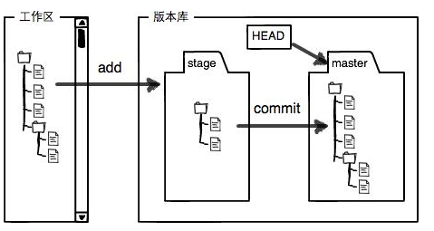
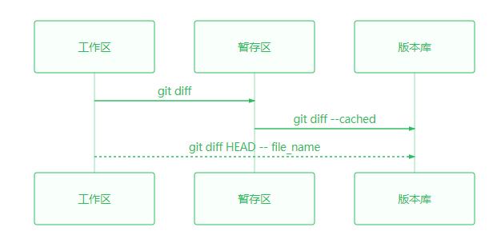
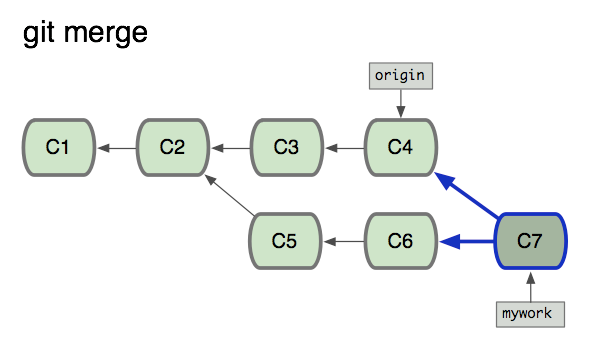
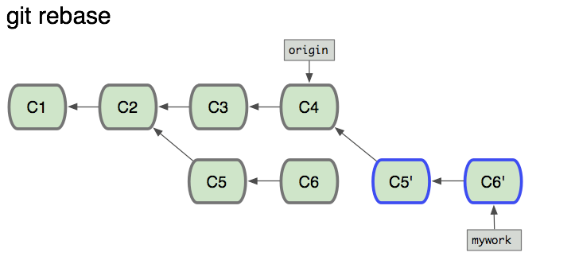

本文内容是对廖雪峰老师[Git教程](https://www.liaoxuefeng.com/wiki/0013739516305929606dd18361248578c67b8067c8c017b000)做的笔记,外加一些自己的学习心得,还抱着学以致用的心态来实践一番  
* [Git学习笔记](#git%E5%AD%A6%E4%B9%A0%E7%AC%94%E8%AE%B0)
  * [Git简介](#git%E7%AE%80%E4%BB%8B)
    * [安装Git](#%E5%AE%89%E8%A3%85git)
    * [创建版本库repository](#%E5%88%9B%E5%BB%BA%E7%89%88%E6%9C%AC%E5%BA%93repository)
    * [把文件添加到版本库](#%E6%8A%8A%E6%96%87%E4%BB%B6%E6%B7%BB%E5%8A%A0%E5%88%B0%E7%89%88%E6%9C%AC%E5%BA%93)
      * [1\.把文件添加到暂存区](#1%E6%8A%8A%E6%96%87%E4%BB%B6%E6%B7%BB%E5%8A%A0%E5%88%B0%E6%9A%82%E5%AD%98%E5%8C%BA)
      * [2\.把文件提交到版本库](#2%E6%8A%8A%E6%96%87%E4%BB%B6%E6%8F%90%E4%BA%A4%E5%88%B0%E7%89%88%E6%9C%AC%E5%BA%93)
    * [Git bash操作文件及文件夹命令](#git-bash%E6%93%8D%E4%BD%9C%E6%96%87%E4%BB%B6%E5%8F%8A%E6%96%87%E4%BB%B6%E5%A4%B9%E5%91%BD%E4%BB%A4)
    * [查看Git安装目录](#%E6%9F%A5%E7%9C%8Bgit%E5%AE%89%E8%A3%85%E7%9B%AE%E5%BD%95)
  * [时光穿梭机](#%E6%97%B6%E5%85%89%E7%A9%BF%E6%A2%AD%E6%9C%BA)
    * [版本退回](#%E7%89%88%E6%9C%AC%E9%80%80%E5%9B%9E)
    * [工作区和暂存区](#%E5%B7%A5%E4%BD%9C%E5%8C%BA%E5%92%8C%E6%9A%82%E5%AD%98%E5%8C%BA)
      * [掌握仓库当前的状态](#%E6%8E%8C%E6%8F%A1%E4%BB%93%E5%BA%93%E5%BD%93%E5%89%8D%E7%9A%84%E7%8A%B6%E6%80%81)
      * [查看修改内容](#%E6%9F%A5%E7%9C%8B%E4%BF%AE%E6%94%B9%E5%86%85%E5%AE%B9)
    * [撤销修改](#%E6%92%A4%E9%94%80%E4%BF%AE%E6%94%B9)
    * [文件名里有空格和()的情况](#%E6%96%87%E4%BB%B6%E5%90%8D%E9%87%8C%E6%9C%89%E7%A9%BA%E6%A0%BC%E5%92%8C%E7%9A%84%E6%83%85%E5%86%B5)
    * [删除文件](#%E5%88%A0%E9%99%A4%E6%96%87%E4%BB%B6)
  * [远程仓库](#%E8%BF%9C%E7%A8%8B%E4%BB%93%E5%BA%93)
    * [添加远程库](#%E6%B7%BB%E5%8A%A0%E8%BF%9C%E7%A8%8B%E5%BA%93)
    * [从远程库克隆](#%E4%BB%8E%E8%BF%9C%E7%A8%8B%E5%BA%93%E5%85%8B%E9%9A%86)
    * [取消链接并删除本地库](#%E5%8F%96%E6%B6%88%E9%93%BE%E6%8E%A5%E5%B9%B6%E5%88%A0%E9%99%A4%E6%9C%AC%E5%9C%B0%E5%BA%93)
  * [分支管理](#%E5%88%86%E6%94%AF%E7%AE%A1%E7%90%86)
    * [创建与合并分支](#%E5%88%9B%E5%BB%BA%E4%B8%8E%E5%90%88%E5%B9%B6%E5%88%86%E6%94%AF)
    * [解决冲突](#%E8%A7%A3%E5%86%B3%E5%86%B2%E7%AA%81)
    * [分支管理策略](#%E5%88%86%E6%94%AF%E7%AE%A1%E7%90%86%E7%AD%96%E7%95%A5)
    * [Bug分支](#bug%E5%88%86%E6%94%AF)
    * [Feature分支](#feature%E5%88%86%E6%94%AF)
    * [多人协作](#%E5%A4%9A%E4%BA%BA%E5%8D%8F%E4%BD%9C)
    * [rebase](#rebase)
  * [标签管理](#%E6%A0%87%E7%AD%BE%E7%AE%A1%E7%90%86)
    * [创建标签](#%E5%88%9B%E5%BB%BA%E6%A0%87%E7%AD%BE)
    * [操作标签](#%E6%93%8D%E4%BD%9C%E6%A0%87%E7%AD%BE)
  * [关联多个远程库](#%E5%85%B3%E8%81%94%E5%A4%9A%E4%B8%AA%E8%BF%9C%E7%A8%8B%E5%BA%93)
  * [自定义Git](#%E8%87%AA%E5%AE%9A%E4%B9%89git)
    * [忽略特殊文件](#%E5%BF%BD%E7%95%A5%E7%89%B9%E6%AE%8A%E6%96%87%E4%BB%B6)
      * [Windows下创建\.gitignore文件的常用方法](#windows%E4%B8%8B%E5%88%9B%E5%BB%BAgitignore%E6%96%87%E4%BB%B6%E7%9A%84%E5%B8%B8%E7%94%A8%E6%96%B9%E6%B3%95)
    * [配置别名](#%E9%85%8D%E7%BD%AE%E5%88%AB%E5%90%8D)
      * [删除别名](#%E5%88%A0%E9%99%A4%E5%88%AB%E5%90%8D)  


# Git学习笔记
**分布式版本控制与集中式版本控制的最大区别**
>集中式的版本控制,本地没有历史记录,完整的仓库只存在服务器上,如果服务器挂了,就全都挂了,而分布式如果github挂了可以重建一个服务器,然后把任何一个人的仓库clone过去
*一句话总结:分布式版本控制的每个节点都是完整仓库*

* [Git下载地址](https://git-for-windows.github.io/ )
* [Git User Manual](https://mirrors.edge.kernel.org/pub/software/scm/git/docs/user-manual.html)
* [Git中文手册](https://git-scm.com/book/zh/v2)


```cmd
$ git --help     //不知道怎么办就看帮助呗
```
## Git简介
略
### 安装Git

下载并安装Git,安装完成后，还需要最后一步设置  
`Git Bash`命令行输入：
```
$ git config --global user.name "Your Name"
$ git config --global user.email "email@example.com"
```

*注意git config命令的--global参数，用了这个参数，表示你这台机器上所有的Git仓库都会使用这个配置，当然也可以对某个仓库指定不同的用户名和Email地址*
### 创建版本库repository
* 首先建一个空目录
```cmd
$ mkdir learngit //当前目录下创建文件夹名为learngit
$ cd learngit //进入learngit文件夹目录下
$ pwd  //显示当前目录
```

`pwd`命令用于显示当前目录
* 然后通过`git init`命令把这个目录变成Git可以管理的仓库
```cmd
$ git init  //初始化
$ ls -ah //显示.git目录
```
`ls -ah`用于显示`.git`目录
### 把文件添加到版本库
编写一个readme.txt,放在learngit目录下(或者子目录)
```cmd
$ vi readme.txt
```


|Vim |快捷键说明|
|---|---|
|Esc |退出编辑,跳到命令模式|
|:w |保存文件但不退出vi|
|:w file |将修改另外保存到file中,不退出vi|
|:w! |强制保存,不退出vi|
|:wq|保存文件并退出vi|
|:q |不保存文件,退出vi|
|:q!| 不保存文件,强制退出vi|
|:e! |放弃所有修改,从上次保存文件开始再编辑|


#### 1.把文件添加到暂存区
使用`git add file_name` 或 `git stage file_name`
```
$ git add readme.txt
```

#### 2.把文件提交到版本库
```
$ git commit -m "wrote a readme file"  
```
-m后面是本次提交的说明,一次可以提交多个文件  
**注意:**`git commit` 指定文件的时候会直接提交**工作区**的文件,不指定文件的时候提交的是**缓存区`stage`的所有文件**
```
$ git commit readme.txt -m "balabala"
```
### Git bash操作文件及文件夹命令
|命令示例|用途|
|---|---|
|cd d:\Github|切换d盘下面的Github目录|
|cd ..|回退到上一个目录|
|cd|回退到主目录|
|pwd|显示当前目录路径|
|ls(ll)|列出当前目录中的所有文件,ll更详细|
|ls(ll) -a|列出当前目录中的所有文件包括隐藏目录|
|touch readme.md|新建一个文件|
|rm readme.md|删除一个文件|
|mkdir img|新建一个文件夹img|
|rm -r img|删除一个文件夹img|
|mv readme.md img|把当前目录下的目标文件移动到一个指定目录,使用相对路径|
|reset|清屏,清空git bash 命令窗口中的所有内容|
### 查看Git安装目录
* Windows
    * cmd `where git`
* Mac
    * 命令行 `which git`
## 时光穿梭机
### 版本退回
```
git reset --hard commit_id
```

* `HEAD`指向的版本就是当前版本，因此，Git允许我们在版本的历史之间穿梭，使用命令`git reset --hard commit_id`
    * Git的`commit_d`(版本号)是一个十六进制的用SHA1计算出来的数字
    * 在Git中用`HEAD`表示当前版本,上一个版本就是`HEAD^`,上一百个版本写成`HEAD~100`
    * 使用`git reset --hard HEAD^`命令退回上一个版本
* 穿梭前，用`git log`可以查看提交历史，以便确定要回退到哪个版本
    * 使用`git log --pretty=oneline`让记录单行显示
    * 使用`git log`或`git reflog` 加`file_name`查看指定文件的历史
* 要重返未来，用`git reflog`查看命令历史，以便确定要回到未来的哪个版本
    * Git 提供一个命令`git reflog`来记录你的每一次命令,这样就可以找到所有版本的`commit id`  
***
### 工作区和暂存区
* **工作区(Working Directory)**  
你在电脑里能看到的目录
* **版本库(Repository)**  
工作区有一个隐藏目录`.git`,这个不算工作区,而是Git的版本库.我们可以称它为*Repo*  
*Repo*里存放了很多东西,其中最重要的就是暂存区`stage`(或者叫index),还有Git为我们自动创建的第一个分支(`Branch`)`master`.以及指向`master`的一个指针叫`HEAD`.  
  
`cat file_name`命令，其功能是显示在工作区、暂存区和分支里同名文档的**最新修改版本的内容**

前面讲了我们把文件往Git版本库里添加的时候，是分两步执行的：  
第一步是用`git add`把文件添加进去，实际上就是把文件修改添加到暂存区；  
第二步是用`git commit`提交更改，实际上就是把暂存区的所有内容提交到当前分支。
#### 掌握仓库当前的状态
```
$ git status
```

#### 查看修改内容
下面是关于 `git diff`的一些使用区别  
  
另外可以使用`git diff commit_id_1 commit_id_2`比较两个不同版本的区别  

`cat file_name`命令，其功能是显示在工作区、暂存区和分支里同名文档的**最新修改版本的内容**


### 撤销修改
* **场景1**：当你改乱了**工作区**某个文件的内容，想直接丢弃工作区的修改时，用命令`git checkout -- file_name`
    * 可以用`git checkout -- *`丢弃所有工作区文件的修改
* **场景2**：当你不但改乱了工作区某个文件的内容，还添加到了**暂存区**时，想丢弃修改，分两步
    * 第一步用命令`git reset HEAD file_name`就回到了**场景1**
        * 使用`git reset HEAD`丢弃所有暂存区的修改
    * 第二步按**场景1**操作
* **场景3**：已经提交了不合适的修改到版本库时，想要撤销本次提交，参考**版本回退**一节，不过前提是没有推送到远程库。

注意:使用版本退回操作`git reset --hard `会导致所有暂存区和工作区的当前修改但未commit的内容全部丢弃.
特别:使用`git reset --hard HEAD`会导致上述结果,并在`git reflog`中生成记录,但不改变


### 文件名里有空格和()的情况
Git命令（或者所有的shell命令中）中出现括“（）”时系统把它看做一个有特殊意义的命令从而尝试去执行它。  
因此如果文件名中出现括号，系统找不到括号里要执行的命令就会报错。  
我们要让系统忽略括号的特殊意义，方法是用“”双引号把文件名括起来，或者用转义符将括号转义.  
例如文件名为git (1).md  
以下的写法都是可以的:  
`git add "git (1).md"`
`git add git" "\(1\).md`
`git add git" (1)".md`

### 删除文件
使用`rm file_name`删除本地文件  
使用` git rm file_name`提交删除到暂存区  
使用`git commit -m "balabala"`提交到本地库    
**注意:** 可以直接使用`git rm file_name`删除本地文件以及提交删除到暂存区,但仅用于暂存区有此本地文件的情况  

## 远程仓库

注册GitHub账号

由于你的本地Git仓库和GitHub仓库之间的传输是通过SSH加密的，所以，需要一点设置：

* 第1步：创建SSH Key
```
$ ssh-keygen -t rsa -C  "youremail@example.com"
````
然后在用户主目录里找到`.ssh`目录,里面有`id_rsa`和`id_rsa.pub`两个文件`id_rsa`是私钥,`id_rsa.pub`是公钥.  

>`cd ~`进入用户主目录
 `cd .ssh`进入.ssh目录
 `ls`列出.ssh目录的文件
 `cat ~/.ssh/id_rsa.pub`看到id_rsa.pub文件的内容


* 第2步：登陆GitHub
>打开“Account settings”，“SSH Keys”页面：然后，点“Add SSH Key”，填上任意Title，在Key文本框里粘贴id_rsa.pub文件的内容

### 添加远程库

* 要关联一个远程库，使用命令
```
git remote add origin git@server_name:path/repo_name.git
```
这里使用的命令是
`git remote add origin git@github.com:HuChanghong/learngit.git`


* 关联后，使用命令`git push -u origin master`第一次推送master分支的所有内容


* 此后，每次本地提交后，只要有必要，就可以使用命令`git push origin master`推送最新修改

>ssh不行是因为你没有设置ssh秘钥  
1：生成秘钥：`ssh-keygen -t rsa -C "你自己的邮箱" `  
(这里不要设置密码，直接按回车就可以，以后更新就不需要密码)  
2：` id_rsa` 这个文件是你的私钥、`id_rsa.pub`是你的公共密钥，用记事本打开文件`id_rsa.pub`,把里面的内容复制到github配置ssh  
3：添加私秘钥到ssh: `ssh-add id_rsa`（如果添加失败可以先执行命令`ssh-agent bash`,然后再次添加私秘钥。）  
4: 用`ssh -T git@github.com` 判断是否绑定成功。如果返回successfully 表示成功  
### 从远程库克隆

* 要克隆一个仓库，首先必须知道仓库的地址，然后使用`git clone`命令克隆。
```
git clone git@github.com:HuChanghong/MarkdownStudy.git
```
* Git支持多种协议，包括`https`，但通过`ssh`支持的原生`git`协议速度最快。
### 取消链接并删除本地库
* 查看本地库关联了那些远程库`git remote -v`
* 取消本地目录下关联的远程库`git remote rm origin`
    * 此处`origin`是指你创建与远程库的链接的时候所使用的名字
* 删除本地库
    * `git branch` #显示本地所有分支
    * `git init` 1#初始化仓库 
    * `ls -a` 2#查看内部文件
    * `rm -rf .git` 3#强删.git
    * `cd ..` 5#回退
    * `rm -rf file_name` 6# 强删文件夹

## 分支管理

### 创建与合并分支
* 查看分支：`git branch`
* 创建分支：`git branch <name>`
* 切换分支：`git checkout <name>`
* 创建+切换分支：`git checkout -b <name>`
* 合并某分支到当前分支：`git merge <name>`
* 删除分支：`git branch -d <name>`

### 解决冲突

* 当Git无法自动合并分支时，就必须首先解决冲突。
* 解决冲突后，再提交，合并完成。
* 解决冲突就是把Git合并失败的文件手动编辑为我们希望的内容，再提交。
* 用git log --graph命令可以看到分支合并图。

>`git merge branch_name`提示 `conflict`  
>`git status`查看冲突的文件  
>打开这个文件,修改保存  
>用带参数的git log也可以看到分支的合并情况：  
>`git log --graph --pretty=oneline --abbrev-commit`  
>最后删除不需要的分支  

### 分支管理策略

>在实际开发中，我们应该按照几个基本原则进行分支管理：首先，`master`分支应该是非常稳定的，也就是仅用来发布新版本，平时不能在上面干活；那在哪干活呢？干活都在`dev`分支上，也就是说，`dev`分支是不稳定的，到某个时候，比如1.0版本发布时，再把`dev`分支合并到`master`上，在`master`分支发布1.0版本；你和你的小伙伴们每个人都在`dev`分支上干活，每个人都有自己的分支，时不时地往`dev`分支上合并就可以了。


合并分支时，加上`--no-ff`参数就可以用普通模式合并，合并后的历史有分支，能看出来曾经做过合并，而`fast forward`合并就看不出来曾经做过合并。

注意`--no-ff`参数，表示禁用`Fast forward`
因为本次合并要创建一个新的commit，所以加上`-m`参数，把commit描述写进去
```
git merge --no-ff -m "balabala" branch_name
```

### Bug分支
>修复bug时，我们会通过创建新的bug分支进行修复，然后合并，最后删除；
>当手头工作没有完成时，先把工作现场`git stash`一下，然后去修复bug，修复后，再`git stash pop`，回到工作现场。


Git提供了一个`stash`功能，可以把当前工作现场“储藏”起来，等以后恢复现场后继续工作
```
git stash
```
我理解的`stash`,就像是把当前的`WIP`压栈(这里`WIP`的含义就是所有修改了但未commit的数据)然后再一个一个取出来,默认的`git stash pop`是按照自栈顶开始的顺序依次出栈,也可以使用`git stash pop stash@{num}`的方式取出指定的`WIP`
我们可以用` git stash list`查看当前压栈了多少个`WIP`

**注意:**`git stash`不能将未被追踪的文件(untracked file)压栈,也就是从未被`git add`过的文件,也就是你在使用`git status`命令看到的提示`Untracked files`所列出的文件,所以在`git stash`之前一定要用`git status`确认没有`Untracked files`
**另外**在有`WIP`没有`commit` 或者`stash`的情况下是无法切换分支的

### Feature分支

* 开发一个新feature，最好新建一个分支；
* 如果要丢弃一个没有被合并过的分支，可以通过`git branch -D <name>`强行删除


### 多人协作
多人协作的工作模式通常是这样：

>* 首先，可以试图用`git push origin <branch-name>`推送自己的修改；
>* 如果推送失败，则因为远程分支比你的本地更新，需要先用`git pull`试图合并；
>* 如果合并有冲突，则解决冲突，并在本地提交；
>* 没有冲突或者解决掉冲突后，再用`git push origin <branch-name>`推送就能成功！
>* 如果`git pull`提示`no tracking information`，则说明本地分支和远程分支的链接关系没有创建，用命令`git branch --set-upstream-to=origin/<branch-name> <branch-name>`。
>* 这就是多人协作的工作模式，一旦熟悉了，就非常简单。


* 查看远程库信息，使用`git remote -v`；
* 本地新建的分支如果不推送到远程，对其他人就是不可见的；
* 从本地推送分支，使用`git push origin branch-name`，如果推送失败，先用`git pull`抓取远程的新提交；
* 在本地创建和远程分支对应的分支，使用`git checkout -b branch-name origin/branch-name`，本地和远程分支的名称最好一致；
* 建立本地分支和远程分支的关联，使用`git branch --set-upstream-to=origin/branch-name branch-name`；
* 从远程抓取分支，使用`git pull`，如果有冲突，要先处理冲突。

### rebase

这是git文档强调的使用注意情形和原则
>只对尚未推送或分享给别人的本地修改执行`rebase`操作清理历史；
>从不对已推送至别处的提交执行`rebase`操作


[gitbook.liuhui998](http://gitbook.liuhui998.com/4_2.html)下图来自这篇链接    
  
  
>`git rebase`会把你的`my work`分支里的每个提交`commit`取消掉，并且把它们临时 保存为补丁`patch`(这些补丁放到".git/rebase"目录中),然后把`mywork`分支更新 到最新的`origin`分支，最后把保存的这些补丁应用到`mywork`分支上。

>当`mywork`分支更新之后，它会指向这些新创建的提交`commit`,而那些老的提交会被丢弃。 如果运行垃圾收集命令`pruning garbage collection`, 这些被丢弃的提交就会删除. 
## 标签管理

>发布一个版本时，我们通常先在版本库中打一个标签（tag），这样，就唯一确定了打标签时刻的版本。将来无论什么时候，取某个标签的版本，就是把那个打标签的时刻的历史版本取出来。所以，标签也是版本库的一个快照。Git的标签虽然是版本库的快照，但其实它就是指向某个commit的指针（跟分支很像对不对？但是分支可以移动，标签不能移动），所以，创建和删除标签都是瞬间完成的。

*类似IP和域名的关系*

### 创建标签

* 命令`git tag <tagname>`用于新建一个标签，默认为`HEAD`，也可以指定一个`commit id`；
    * `git tag tag_name commit_id`
* 命令`git tag -a <tagname> -m "blablabla..."`可以指定标签信息；
    * 用`-a`指定标签名，`-m`指定说明文字
* 命令`git tag`可以查看所有标签。
    * `git show tag_name`查看标签信息

### 操作标签

命令`git push origin <tagname>`可以推送一个本地标签；
命令`git push origin --tags`可以推送全部未推送过的本地标签；
命令`git tag -d <tagname>`可以删除一个本地标签；
命令`git push origin :refs/tags/<tagname>`可以删除一个远程标签。

## 关联多个远程库
>使用多个远程库时，我们要注意，`git`给远程库起的默认名称是`origin`，如果有多个远程库，我们需要用不同的名称来标识不同的远程库。


先用`git remote -v`查看远程库信息

如果本地库已经关联了`origin`的远程库，并且，该远程库指向`GitHub`。我们可以删除已有的`GitHub`远程库
```
git remote rm origin
```
使用如下命令关联远程库
```
git remote add remote_name git@server_name:path/repo_name.git
```

例如要关联`Github`远程库
```
git remote add github git@github.com:Github_id/repo_name.git
```
再比如要关联`码云`远程库
```
git remote add gitee git@gitee.com:Github_id/repo_name.git
```
此时要推送到不同的远程库则代码中使用对应的远程库名称(`remote_name`)
```
git push remote_name master
```
## 自定义Git
### 忽略特殊文件

>有些时候，你必须把某些文件放到Git工作目录中，但又不能提交它们，比如保存了数据库密码的配置文件啦，等等，每次`git status`都会显示`Untracked files` ...，有强迫症的童鞋心里肯定不爽。好在Git考虑到了大家的感受，这个问题解决起来也很简单，在`Git工作区的根目录下`创建一个特殊的`.gitignore`文件，然后把要忽略的文件名填进去，Git就会自动忽略这些文件。不需要从头写`.gitignore`文件，GitHub已经为我们准备了各种配置文件，只需要组合一下就可以使用了。所有配置文件可以直接在线浏览：<https://github.com/github/gitignore>


**忽略文件的原则是：**

1. 忽略操作系统自动生成的文件，比如缩略图等；
2. 忽略编译生成的中间文件、可执行文件等，也就是如果一个文件是通过另一个文件自动生成的，那自动生成的文件就没必要放进版本库，比如Java编译产生的.class文件；
3. 忽略你自己的带有敏感信息的配置文件，比如存放口令的配置文件。

可以用`git add -f`强制添加被`gitignore`的文件
可以用`git check-ignore`命令检查是什么规则导致的无法添加文件
```
git check-ignore -v file_name
```

**注意:**`.gitignore`文件本身要放到版本库里，并且可以对`.gitignore`做版本管理！


#### `Windows`下创建`.gitignore`文件的常用方法
1. 在`git bash`中`cd`切换到根目录`touch .gitignore`命令创建
2. 在资源管理器创建文件时，文件命名“`.gitignore.`”，注意结尾有个.号，回车确认时系统会自动存成`.gitignore`
3. 打开文本编辑器，保存时文件名输入“`.gitignore`”，保存类型选“`所有文件`”
4. 进入cmd命令行，执行 `echo > .gitignore` 输入空内容并创建文件，或执行 `rename somefile .gitignore`、`copy somefile .gitignore` 从已有文件复制、重命名。

### 配置别名
只需要先如此如此
```
git config --global alias.lg "log --color --graph --pretty=format:'%Cred%h%Creset -%C(yellow)%d%Creset %s %Cgreen(%cr) %C(bold blue)<%an>%Creset' --abbrev-commit"
```
然后就可以只用`git lg`输出辣么一长串的代码,看到这里我沉默了,然后我想了半天,我为什么干脆不用GitDesktop呢,可能就是因为热爱敲代码吧(雾


配置Git的时候，加上`--global`是针对当前用户起作用的，如果不加，那只针对当前的仓库起作用。
每个仓库的Git配置文件都放在`.git/config`文件,打开配置文件,别名就在`[alias]`后面，要删除别名，直接把对应的行删掉即可
当前用户的Git配置文件放在`用户主目录`下的一个隐藏文件`.gitconfig`中

查看用户的配置信息使用`git config --global --list`命令
查看当前仓库的配置信息使用`git config --local --list`命令
#### 删除别名
命令删除一个已定义的别名 `git config --global --unset alias.ci `
`cd .git` `vi config`打开对应的配置文件,别名就在`[alias]`后面，直接把对应的行删掉即可

>gitconfig配置文件的读取顺序： 
>linux中类似用户的配置文件一样有3层，系统级，用户级，项目级。 
>windows也基本一样，但常常只存在于是用户根目录(C:\User\xxx)，项目目录中。 最下层的覆盖上面的，alias配置也在其中，手动改配置文件也和命令一样。 加了--global选项的，表示配置写到了用户级，--system是系统级，win是在安装目录（如C:\Program Files\Git\mingw64\etc），不加就在项目级

